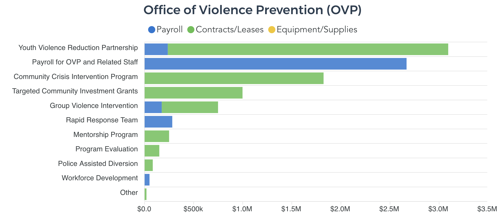
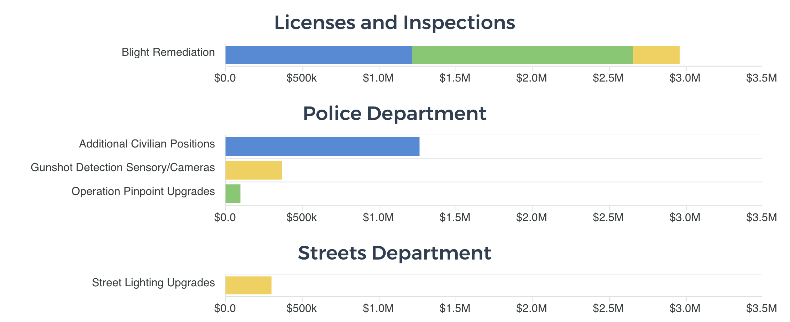

# AntiViolenceSpending
The code behind the data release of budgeted spending for Philadelphia's FY20 violence reduction programs.

The interactive report is available [here](https://controller.phila.gov/philadelphia-audits/data-release-fy20-violence-reduction-spending/).




## Tools

Built using vue, [esri-leaflet](https://github.com/Esri/esri-leaflet), and [vue-apexcharts](https://github.com/apexcharts/vue-apexcharts)

## Development

#### Compiles and hot-reloads for development

```
npm run serve
```

#### Compiles and minifies for production

```
npm run build
```
